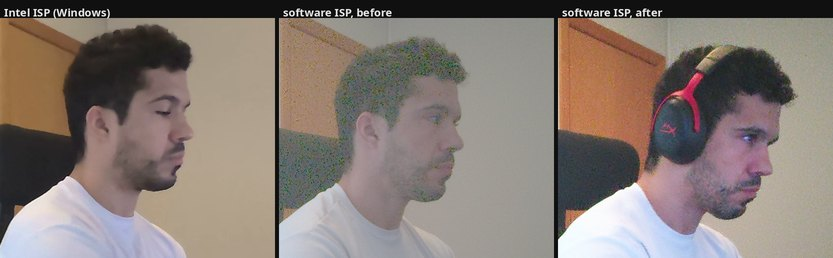
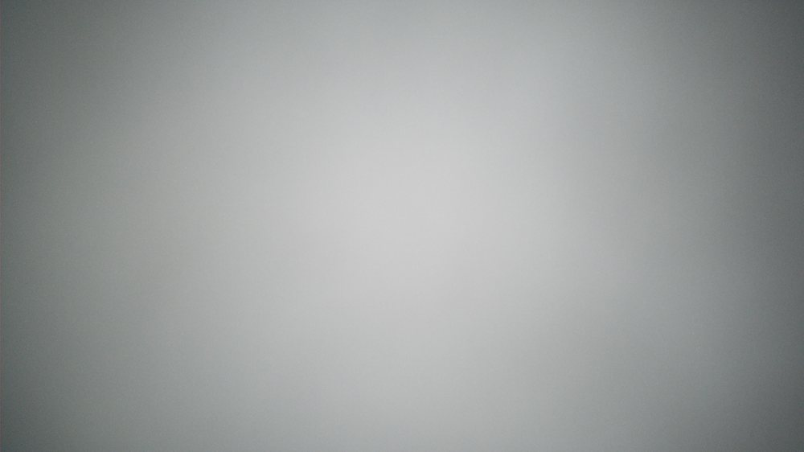

# ov02c10-linux

Making the webcam on an Intel IPU6 laptop usable under Linux, and measuring it
against the vendor's own ISP to find out how far off it still is.

The machine is a Samsung Galaxy Book (NP960XGL) with an OmniVision OV02C10
behind an Intel IPU6. The IPU6's imaging hardware has no open driver, so on
Linux the picture gets nothing from it: every step from Bayer to RGB happens in
libcamera's software ISP. That makes this laptop a fairly demanding test of
that code, and four of the defects found here were in libcamera itself rather
than in anything specific to this camera.



Left to right in the comparison shots: the same sensor under Intel's ISP on
Windows, the software ISP before this work, and after. Same scene, minutes
apart.

## What was wrong

Each of these was measured, with the two settings interleaved so that changing
light could not favour either, and with the control repeated. Where the control
disagreed with itself the result was thrown away rather than published — that
happened four times.

| Defect | Before | After |
| --- | ---: | ---: |
| Brightness pulsing (the AGC could never settle) | 2.80 DN RMS | **0.38 DN** |
| Image median, against a target of 115 | 173 | **114** |
| Tonal range in use, out of 255 | 165 | **221** |
| Frame below 32 (Intel's ISP: 4.3%) | 0.7% | **3.2%** |
| White balance changing with the requested resolution | 4.2% | **0.3%** |
| 4:3 crop, which should be centred at x=240 | x=9 | **x=243** |
| Red at the corners, relative to the centre | −11% | **0%** |

Four of these are bugs in libcamera's software ISP, not in this camera:

**The AGC could not make a small correction.** `againMinStep` was taken as one
hundredth of the sensor's gain *range*, which has nothing to do with how finely
the gain can be set. On a sensor whose range runs 1–248 that is 2.47, so the
smallest correction possible was around 12% at a typical indoor gain. Every step
crossed the target and the exposure oscillated forever. Taking the step from the
sensor instead changes it to 0.0625.

**Metering read the corner of the frame.** In the GPU debayer the statistics
window was passed as a size with no origin, on the assumption — true of the CPU
debayer, false here — that something downstream offsets it. So it sat at the
corner of the sensor and its extent followed the requested stream size: a
640×480 stream metered the top-left fifteen percent of the picture while a 1080p
stream from the same camera metered nearly all of it. Exposure and white balance
depended on the resolution the application happened to ask for.

**The 4:3 crop came off one side.** A stream whose aspect ratio differs from the
sensor's has to be cropped, but the projection was anchored at one edge, so a
640×480 stream showed the sensor from x=48 instead of from the x=240 that
centring calls for. The subject had to sit a sixth of a frame off centre to
appear centred, and the framing moved when the application changed resolution.

**White balance was thrown by anything large and coloured.** Grey world reads
the average of the scene as the colour of the light, so a wooden door is taken
for the light and balanced away. Two changes: exclude saturated pixels from the
colour sums, since a clipped pixel has lost the ratio between its channels and
can only pull towards grey; and estimate from the pixels that already look
neutral rather than from the whole frame.

The rest is specific to a camera with no hardware ISP behind it: temporal
denoising, a tone curve that does not wash the picture out, and lens shading.

## Upstream

Five patches are prepared against libcamera master in
[`libcamera/upstream/`](libcamera/upstream/). They apply cleanly, build, and
pass `utils/checkstyle.py`. Four are the general fixes above; one adds the
OV02C10 sensor helper, without which the AGC reads the sensor's gain codes as
multipliers — a code of 16 taken for 16× rather than 1.0× — believes it already
has all the gain it could want, and leaves the picture dark.

Everything else lives in [`libcamera/softisp-ov02c10.patch`](libcamera/), which
is larger and not yet proposed upstream.

## Install

The kernel module, as an AUR-style package:

```bash
cd packaging && makepkg -si
```

It sets the sensor's clock to the 26 MHz this board actually feeds it, and
carries defaults for rotation, flicker avoidance and gain extension. Built
through DKMS, so it survives kernel updates.

The software ISP work, which has to be rebuilt into the distribution's
libcamera:

```bash
./scripts/install-libcamera.sh
systemctl --user restart pipewire wireplumber
```

Run that again after any `pacman -Syu` that updates libcamera — the package will
overwrite it.

On a hybrid-graphics laptop, force the camera stack onto Mesa. With NVIDIA's EGL
the dma-buf import fails and the camera hands out no frames at all:

```
# ~/.config/systemd/user/{pipewire,wireplumber}.service.d/10-egl-mesa.conf
[Service]
Environment=__EGL_VENDOR_LIBRARY_FILENAMES=/usr/share/glvnd/egl_vendor.d/50_mesa.json
Environment=LIBCAMERA_SIMPLE_TUNING_FILE=%h/.config/libcamera/ov02c10.yaml
```

To see what the camera is doing:

```bash
./scripts/check-camera.sh
```

## Colour matrices

The generic colour matrix that ships here is a conservative guess. If your
machine dual boots, a real one measured on your exact module is already on the
disk: Intel ships a per-module characterisation with its Windows camera driver,
made in a lab against a colour chart.

```bash
sudo mount -o ro /dev/nvme0n1pX /mnt/win
./tuning/extract-tuning.py /mnt/win/Windows/System32/OV02C10_*.aiqb \
  > ~/.config/libcamera/ov02c10.yaml
sudo umount /mnt/win
```

On the module here that was worth +48% saturation for +30% chroma noise, with
the neutrals unmoved. The script ships no data of its own — it reads your
driver, on your machine. Those numbers are Intel's and should not be
redistributed, which is why this repository extracts them rather than carrying
them.

The `.aiqb` is an undocumented container, so the script does not parse it. It
looks for the one thing a colour matrix cannot hide: every row sums to 1,
because a matrix that changed the colour of grey would change the white balance.

## Lens shading

Measured with a sheet of paper held against the lens, lit from behind by a white
screen. The corners receive a quarter of the light the centre does, and red
falls eleven percent further than green — which is what tints the edge of a face
that is not centred.



The coefficients are measured on the module in this laptop and are compiled in.
Another OV02C10 of the same part should be close, but a different lens or
different mechanical vignetting will not be — if the edges of your frame come
out tinted the other way, that is why, and the flat-field recipe below is how to
measure your own.

Colour and brightness are corrected separately because they cost differently.
Flattening the colour is nearly free and is on by default. Flattening the
brightness needs a gain of four at the corners and multiplies the noise there by
the same four, so it is off by default; `LIBCAMERA_LENS_LUMA=1` turns it on.

Getting a usable flat field took four attempts, and the three failures are worth
knowing about:

- **Paper against the lens, pointed at the room.** 21% asymmetry top to bottom.
  The paper was lit by the room, and the room is not uniform.
- **A white wall, captured twice with the laptop rotated 180° between.** The
  rotation should cancel a gradient fixed in the room, and did not: both
  captures came out asymmetric with the *same* sign, because the shadow was the
  laptop's own and turned with the camera.
- **A white screen at close range, no paper.** A falloff of fifteen. An LCD
  panel is not Lambertian — it dims considerably off-axis, and with the camera
  close to a large screen the edges of the frame see it at a steep angle.

What worked was paper against the lens pointed at the white screen: the paper is
a real diffuser, so it removes the panel's angular falloff, and the light comes
from behind it, so the laptop cannot shadow it. The result is symmetric to
within one percent in both axes, which is the signature of lens shading with
nothing else mixed in.

## Where this is still worse

Noise. On a flat wall the residual measures 1.4 DN against 0.24 for the vendor
ISP. Some of that difference is the reference being an H.264 recording, which
smooths grain, and that part cannot be separated with the data at hand. The rest
is real: Intel's ISP does spatial denoising this pipeline does not.

The upper midtones. Intel's ISP puts a quarter of the frame between 160 and 192;
this puts about half that.

The AGC takes roughly 75 frames to converge when the camera opens.

## Things measured wrong first

Included because they were the expensive part, and because the same mistakes are
easy to repeat.

**Two techniques were measured against a weaker baseline than the one they would
actually replace, and both reversed sign when measured properly.** Motion
compensation was worth 1.66× against a fixed-alpha temporal filter; against the
adaptive filter that actually ships it costs 12.6% over a static background and
gains 5.6% on a moving subject, so it is off by default. Constraining white
balance to the sensor's measured illuminants improved on whole-frame grey world;
against the neutral-pixel estimator that ships it made things worse, because
that estimator is already accurate to 1.9% and the room's LED sits 3.5% off the
five characterised illuminants. Before measuring a technique, ask which code it
would replace, and measure against that, running.

**Every whole-frame temporal measurement was contaminated by the monitors in
shot.** Their content changes on its own; the map of per-pixel variance showed
13 DN on the desk against 1.5 on a wall. Worse, the contamination is not stable
between runs, so it breaks repeatability without moving the averages — brightness
and gain agree across runs while the number moves 60%.

**A measurement that fits the hypothesis is not a confirmation.** Checking
colour shading on a scene using a "near-neutral pixels" mask reports −2% where
the flat field says −11%, because the mask excludes the tinted corners by
construction.

**A recovery procedure that has never been run is not a recovery procedure.**
The script that reapplies all of this after a distribution update was broken for
weeks without anyone noticing: generated with a plain `git diff` in a tree that
is a package extraction, it carried the distribution's own patches along with
it, and conflicted with them on the next extraction.

## Licence

`kernel/` is GPL-2.0-only, matching the driver it derives from. The libcamera
changes are LGPL-2.1-or-later, matching libcamera. Nothing under `tuning/`
contains vendor data.
